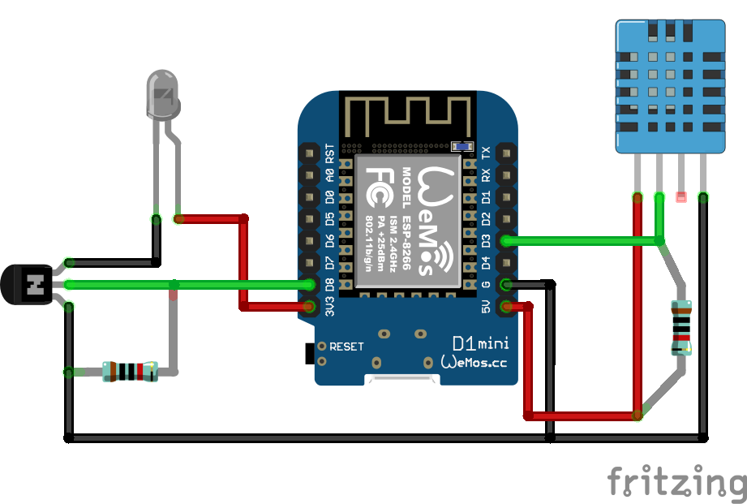

# homebridge-daikin-esp8266

A Homebridge plugin to control my Daikin AC using an ESP8266 micro controller.

```json
"accessories": [
    {
        "accessory": "Daikin ESP8266",
        "name": "Daikin",
        "host": "192.168.1.10"
    }
]
```

